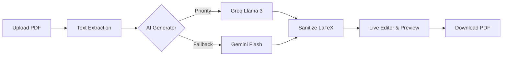

# 📄 AI LaTeX Resume Builder

> **Transform your PDF resumes into professional, ATS-optimized LaTeX masterpieces using the power of AI.**

AI LaTeX Resume Builder is a sophisticated web application that leverages advanced AI models (Groq Llama 3 & Gemini Flash) to parse existing PDF resumes and reconstruct them into clean, high-quality LaTeX source code. It features a real-time side-by-side editor and PDF previewer, ensuring your resume looks perfect before you download.

---

## ✨ Key Features

- 🤖 **Multi-Model AI Engine**: Intelligent routing between **Groq (Llama 3.3)** and **Google Gemini** with automatic fallback for maximum reliability.
- ⚡ **Real-time Preview**: Instant PDF recompilation and preview as you edit your LaTeX code.
- 📈 **ATS-Optimized**: Generates LaTeX specifically designed to pass through Applicant Tracking Systems (ATS) with ease.
- 🎨 **Minimalist Design**: A clean, modern UI focused on productivity and pixel-perfect results.
- 🔄 **Smart Sanitization**: Automatically fixes common AI-generated LaTeX formatting errors and ensures compilation safety.
- 📥 **One-Click Download**: Instantly export your final resume as a production-ready PDF.

---

## 🛠️ Tech Stack

### Backend
- **Node.js & Express**: High-performance API handling.
- **AI Integrations**: Groq Cloud (Llama 3.3) & Google Gemini 1.5 Flash.
- **File Processing**: Multer for uploads & PDF-parse for text extraction.
- **LaTeX Compilation**: Integrated `pdflatex` workflow.

### Frontend
- **Vanilla JavaScript**: Lightweight and blazing-fast interface.
- **Modern CSS**: Custom responsive layout with a premium aesthetic.

---

## 🚀 Getting Started

### Prerequisites

- [Node.js](https://nodejs.org/) (v16+)
- [TeX Live](https://www.tug.org/texlive/) or [MiKTeX](https://miktex.org/) (must have `pdflatex` in your system PATH)

### Installation

1. **Clone the repository**
   ```bash
   git clone https://github.com/Pramod-Munnoli/AI_Latex_Resume_Builder.git
   cd AI_Latex_Resume_Builder
   ```

2. **Install dependencies**
   ```bash
   npm install
   ```

3. **Configure Environment Variables**
   Create a `.env` file in the root directory:
   ```env
   PORT=3000
   GROQ_API_KEY=your_groq_api_key
   GEMINI_API_KEY=your_gemini_api_key
   ```

4. **Run the application**
   ```bash
   # Development mode (with nodemon)
   npm run dev

   # Production mode
   npm start
   ```

---

## 📸 Project Workflow



---

## 🤝 Contributing

Contributions are welcome! If you have suggestions for improvement or find any bugs, please open an issue or submit a pull request.

---

## 📄 License

Distributed under the **ISC License**. See `package.json` for details.

---

Developed with ❤️ by [Pramod Munnoli](https://github.com/Pramod-Munnoli)
