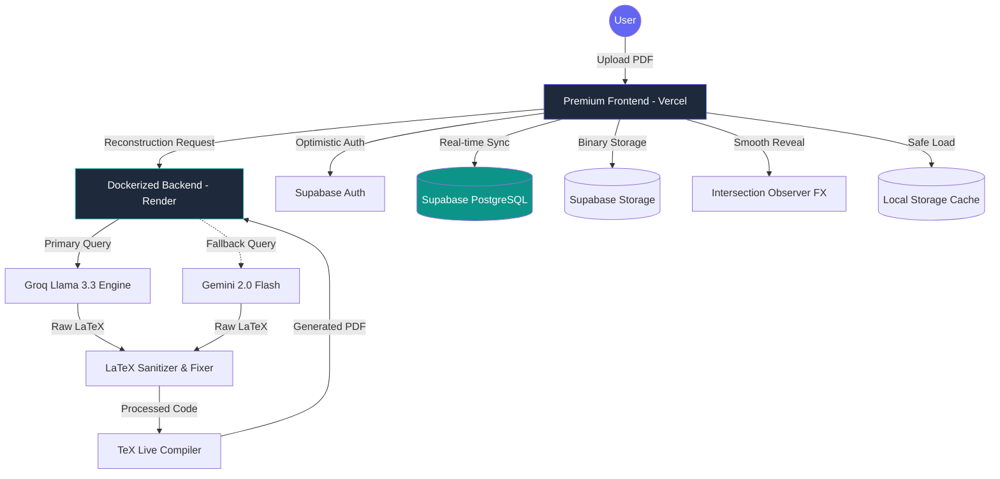

# 📄 AI LaTeX Resume Builder (Enterprise Grade) 🚀

> **The ultimate resume transformation engine. From static PDF to professional LaTeX, driven by state-of-the-art AI and secured in a robust cloud ecosystem.**

### 🌐 [Live Demo: Experience the App](https://ai-latex-resume-builder.vercel.app/)


---

## 🌟 Overview

AI LaTeX Resume Builder is a sophisticated full-stack application designed to solve the "static resume" problem. It intelligently reconstructs unstructured PDF data into high-quality, ATS-optimized LaTeX source code using a dual-LLM orchestration layer (**Groq Llama 3.3** & **Google Gemini 2.0 Flash**). 

The platform features a premium design system, real-time cloud sync, and a professional-grade LaTeX compilation engine.

---

## 🏗️ System working Flow

The application follows a highly decoupled and performant workflow to ensure sub-second response times and 100% data durability.



---

## 🔥 Professional Features

### 🤖 Intelligent AI Orchestration
*   **Dual-Engine Routing**: Primarily uses **Groq (Llama 3.3)** for extreme speed, with **Gemini 2.0 Flash** as a high-reliability fallback.
*   **Context-Aware Reconstruction**: Intelligently maps PDF text to complex LaTeX structures (Education, Experience, Skills, Projects).
*   **Auto-Sanitization**: Automatically detects and escapes special characters to prevent LaTeX compilation errors.

### 🎨 Premium Design System (Aesthetics First)
*   **High-End Visuals**: Modern Glassmorphism UI with vibrant indigo/teal color palettes and fluid responsiveness.
*   **Atomic Animations**: 
    *   Word-by-word reveal for hero sections.
    *   Staggered grid entrance transitions.
    *   Premium slide-and-fade panel animations for the editor.
*   **Performance Optimized**: All animations run via GPU-accelerated CSS transforms and Intersection Observers.

### 🛠️ Professional LaTeX Editor
*   **Live Side-by-Side Preview**: Type LaTeX on the left, see the professional PDF instantly on the right.
*   **Template Ecosystem**: Access a curated gallery of ATS-friendly templates (Modern, Minimal, Student, Developer).
*   **Visual Editor (Hybrid)**: Toggle between raw LaTeX code and a user-friendly field-based editor.

### ☁️ Enterprise Cloud Infrastructure
*   **Supabase Integration**: Secure Auth, real-time database syncing, and persistent object storage.
*   **Optimistic UX**: Uses local caching to show user data (Initials/Profile) instantly on page load before the database response arrives.
*   **Version History**: "My Version" vs. "Original Template" toggling with intelligent diffing to prevent unnecessary recompiles.

---

## 🛠️ Technology Stack

### **Frontend (UI/UX)**
- **Core**: Vanilla JavaScript (ES6+), HTML5, CSS3.
- **FX**: Intersection Observer API, CSS Transitions/Animations.
- **Tools**: Lucide Icons, CodeMirror (Editor), PDF.js (Viewer).

### **Backend (Logic & Processing)**
- **Runtime**: Node.js & Express.
- **AI**: Groq SDK & Google Generative AI (Gemini).
- **Environment**: Docker + TeX Live (Professional LaTeX Distributions).

### **Database & Cloud**
- **Auth/DB**: Supabase (PostgreSQL).
- **Hosting**: Vercel (Frontend), Render (Dockerized Backend).

---

## 🚀 Getting Started

### Local Development
1. **Clone the Source**:
   ```bash
   git clone https://github.com/Pramod-Munnoli/AI_Latex_Resume_Builder.git
   ```
2. **Install Dependencies**:
   ```bash
   npm install
   ```
3. **Environment Setup**:
   Create a `.env` file in the root directory:
   ```env
   GROQ_API_KEY=your_key
   GEMINI_API_KEY=your_key
   SUPABASE_URL=your_project_url
   SUPABASE_ANON_KEY=your_anon_key
   ```
4. **Launch Application**:
   ```bash
   npm run dev
   ```

---

## 🤝 Roadmap & Future
- [ ] **ATS Scoring**: Live analysis of resume quality.
- [ ] **Tailor for Job**: Auto-rewrite bullet points based on a job description.
- [ ] **Multi-Resume Dashboard**: Grid view of all saved versions.

---
**Designed and Developed with ❤️ by [Pramod Munnoli](https://github.com/Pramod-Munnoli)**
