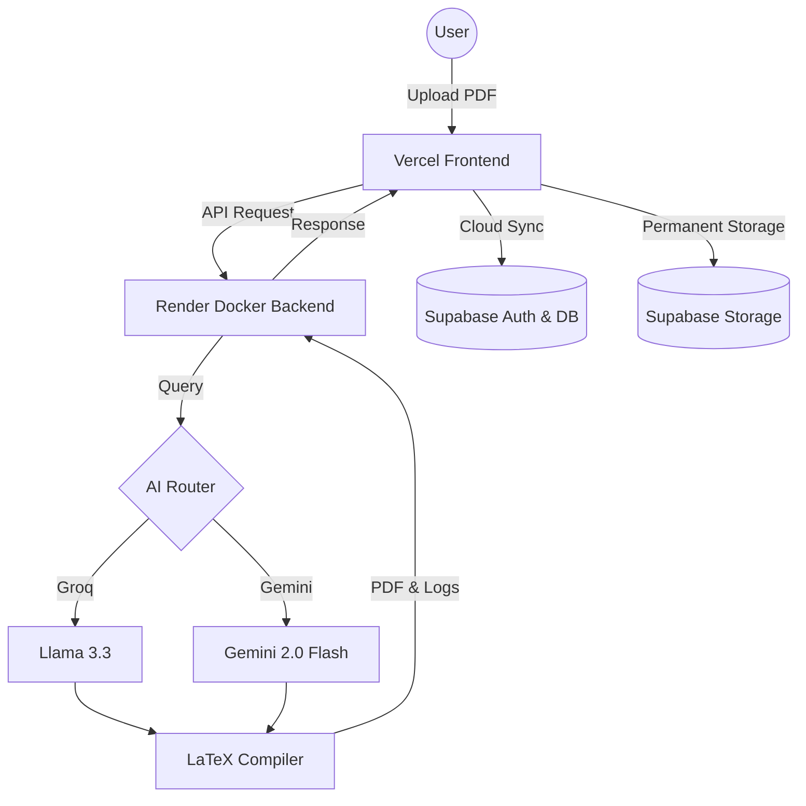

# 📄 AI LaTeX Resume Builder (Production Ready) 🚀

> **The ultimate resume transformation tool. From static PDF to professional LaTeX, backed by AI and secured in the cloud.**

### 🌐 [Live Demo: View Application](https://ai-latex-resume-builder.vercel.app/)


AI LaTeX Resume Builder is a full-featured web application that leverages **Groq (Llama 3.3)** and **Google Gemini 2.5 Flash** to reconstruct PDF resumes into high-quality, ATS-optimized LaTeX. This version includes secure user authentication, real-time cloud synchronization, and a premium mobile-responsive UI.

---

## 🏗️ Technical Architecture & Workflow

The app uses a **Hybrid Cloud Architecture** for maximum performance and reliability.

### 🔄 Workflow Diagram


---

## 🔥 Key Features

- 🔐 **Secure Authentication**: Powered by **Supabase Auth**. Save your progress and access your resume from any device.
- 📂 **Cloud Synchronization**: LaTeX source and generated PDFs are automatically synced to **Supabase PostgreSQL** and **S3-compatible storage**.
- 🛠️ **Intelligent AI Routing**: Uses Groq as the primary engine for speed and Gemini 2.0 Flash as a robust fallback for high reliability.
- 📱 **Ultra-Mobile Responsive**: Optimized UI for mobile devices (including Poco C61) with easy-to-tap buttons and a dedicated full-screen PDF viewer.
- ⚡ **Side-by-Side Live Editor**: Real-time LaTeX editing with an instant preview toggle.
- 🛡️ **Advanced Sanitization**: Built-in protection against LaTeX injection and automatic fixes for AI formatting quirks.

---

## 🚀 Getting Started

### Local Setup
1. **Clone & Install**:
   ```bash
   git clone https://github.com/Pramod-Munnoli/AI_Latex_Resume_Builder.git
   npm install
   ```
2. **Environment Variables (.env)**:
   ```env
   GROQ_API_KEY=your_key
   GEMINI_API_KEY=your_key
   SUPABASE_URL=your_project_url
   SUPABASE_ANON_KEY=your_anon_key
   ```
3. **Run**: `npm run dev`

### 🏗️ Production Architecture
- **Frontend**: Hosted on [Vercel](https://vercel.com)
- **Backend**: Hosted on [Render](https://render.com) (Docker + TeX Live)
- **Database/Auth**: Powered by [Supabase](https://supabase.com)

---

## 🤝 Contributing & License
Feel free to fork and submit PRs. Technical support is available via GitHub Issues.

---
**Designed and Developed with ❤️ by [Pramod Munnoli](https://github.com/Pramod-Munnoli)**
