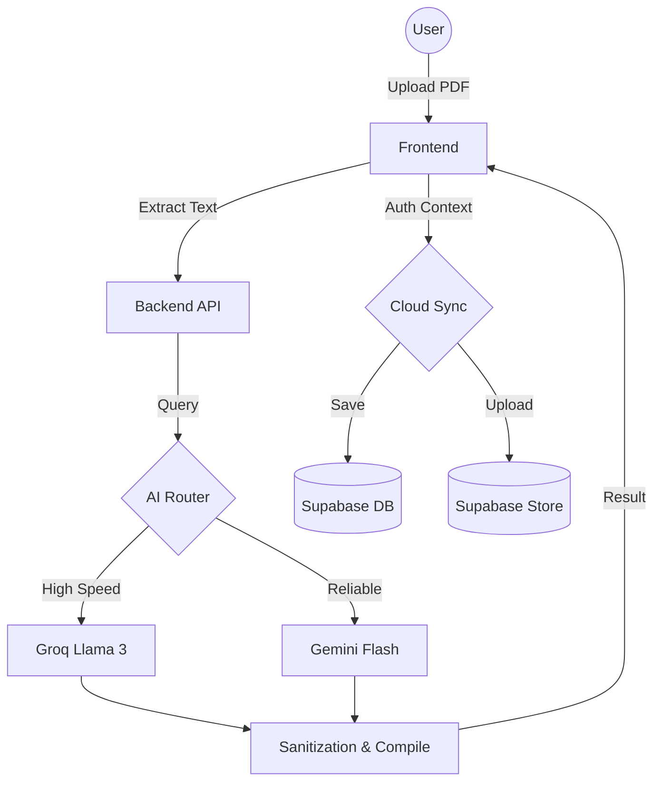

# 📄 AI LaTeX Resume Builder (Final Version)

> **The ultimate resume transformation tool. From static PDF to professional LaTeX, backed by AI and secured in the cloud.**

AI LaTeX Resume Builder is a full-featured web application that leverages **Groq (Llama 3.3)** and **Google Gemini 1.5 Flash** to reconstruct PDF resumes into high-quality, ATS-optimized LaTeX. This final version includes secure user authentication, real-time cloud synchronization, and a premium productivity-focused UI.

---

## 🔥 New & Advanced Features

- 🔐 **Secure Authentication**: Power by **Supabase Auth**. Create an account to save and access your resumes from anywhere.
- ☁️ **Cloud synchronization**: Automatically syncs your LaTeX source and generated PDFs to **Supabase Storage** and **PostgreSQL**. Never lose your progress.
- 🛠️ **Intelligent AI Routing**: Uses Groq as the primary engine for speed and Gemini as a robust fallback for high reliability.
- 🔔 **Premium UI Components**: Modern Toast notification system and real-time status badges for a seamless user experience.
- ⚡ **Side-by-Side Live Editor**: Edit LaTeX code on the left and see the PDF update instantly on the right.
- 🛡️ **Advanced Sanitization**: Built-in protection against LaTeX injection and automatic fixes for AI-generated formatting quirks.

---

## 🏗️ Technical Architecture

### Tech Stack
- **Frontend**: Vanilla JS, Modern CSS (Glassmorphism), Supabase Auth UI.
- **Backend**: Node.js, Express, Multer (Memory Storage).
- **Database/Storage**: Supabase (PostgreSQL & S3-compatible storage).
- **AI Models**: Groq Cloud (Llama 3.3), Gemini 1.5 Flash.
- **Compilation**: TeX Live / pdflatex.

### Visual Workflow


---

## 🚀 Deployment & Hosting

### 1. Local Setup
1. **Clone & Install**:
   ```bash
   git clone https://github.com/Pramod-Munnoli/AI_Latex_Resume_Builder.git
   npm install
   ```
2. **Environment Variables (.env)**:
   ```env
   PORT=3000
   GROQ_API_KEY=your_key
   GEMINI_API_KEY=your_key
   SUPABASE_URL=your_project_url
   SUPABASE_ANON_KEY=your_anon_key
   ```
3. **Run**: `npm run dev`

### 2. Hosting (Final Version)
To host this app on platforms like **Render**, **Railway**, or **DigitalOcean**:
- **System Dependencies**: Ensure the hosting environment has `texlive-latex-extra` and `texlive-fonts-recommended` installed.
- **Persistent Storage**: Not required for the PDF results as they are synced to Supabase Cloud, but ensure the `backend/temp` directory exists and is writable.
- **Environment**: Set all `.env` variables in your provider's dashboard.

---

## 🤝 Contributing & License

Feel free to fork and submit PRs. The project is licensed under the **ISC License**.

---

Designed and Developed by [Pramod Munnoli](https://github.com/Pramod-Munnoli)
