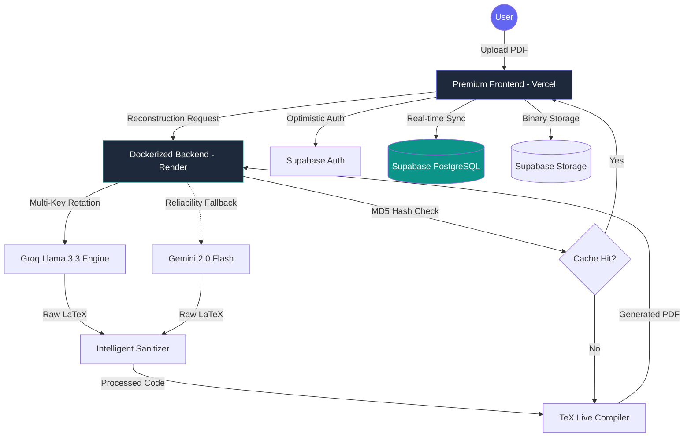

# 📄 AI LaTeX Resume Builder (Enterprise Grade) 🚀

> **The ultimate resume transformation engine. From static PDF to professional LaTeX, driven by state-of-the-art AI and secured in a robust cloud ecosystem.**

### 🌐 [Live Demo: Experience the App](https://ai-latex-resume-builder.vercel.app/)


---

## 🌟 Overview

AI LaTeX Resume Builder is a sophisticated full-stack application designed to solve the "static resume" problem. It intelligently reconstructs unstructured PDF data into high-quality, ATS-optimized LaTeX source code using a dual-LLM orchestration layer (**Groq Llama 3.3** & **Google Gemini 2.0 Flash**). 

The platform features a premium design system, real-time cloud sync, and a professional-grade LaTeX compilation engine with advanced caching.

---

## 🏗️ System working Flow

The application follows a highly decoupled and performant workflow to ensure sub-second response times and 100% data durability.



---

## 🔥 Professional Features

### 🤖 Intelligent AI Orchestration
*   **Multi-Key Failover Routing**: Dynamically rotates through multiple **Groq API keys** to bypass rate limits and ensure maximum uptime.
*   **Dual-Engine Logic**: Primarily uses **Groq (Llama 3.3)** for extreme speed, with **Gemini 2.0 Flash** as a high-reliability fallback.
*   **Auto-Sanitization**: A robust "LaTeX Sanitizer & Fixer" that automatically detects and closes environments (like itemize) and escapes special characters.

### 🎨 Premium Design System (Aesthetics First)
*   **High-End Visuals**: Modern Glassmorphism UI with vibrant indigo/teal color palettes and fluid responsiveness.
*   **Performance Optimized**: All animations run via GPU-accelerated CSS transforms and Intersection Observers for sub-second visual reveals.

### 🛠️ Professional LaTeX Editor & Preview
*   **Compilation Cache (Ultra Fast)**: Uses MD5 hashing to detect identical LaTeX content. If the code hasn't changed, the PDF is served instantly from the cache, bypassing the compilation wait.
*   **Optimized Loading UX**: Integrated **PDF skeleton loaders** and button-level spinners replace global blocking overlays, ensuring the workspace remains interactive during compilation.
*   **Visual Editor (Coming Soon)**: We are developing a hybrid system that will allow users to toggle between a professional Code Editor and a user-friendly field-based interface.
*   **Intelligent Versioning**: Switch seamlessly between your **"Saved Version"** and the **"Original Template"** with built-in diffing logic.

### 🐞 Premium Error Handling & Debugging
*   **Gutter Integration**: Accurate line-number detection (`l.42`) from LaTeX logs with visual red gutter markers in the editor.
*   **Full-Width Error Workspace**: A dedicated, smooth-scrolling compilation output panel at the bottom of the workspace for detailed troubleshooting.
*   **Resilient AI Workflows**: If AI generation fails to compile, the system **preserves the generated code** and displays it in the editor. This allows users to manually fix minor issues and recompile, ensuring AI efforts are never lost.

### ☁️ Enterprise Cloud Infrastructure
*   **Supabase Integration**: Secure Auth via JWT, real-time database syncing, and persistent object storage for generated PDFs.
*   **Optimistic UX**: Uses local caching to show user data (Initials/Profile) instantly on page load before the database response arrives.

---

## 🛠️ Technology Stack

### **Frontend (UI/UX)**
- **Core**: Vanilla JavaScript (ES6+), HTML5, CSS3.
- **FX**: Intersection Observer API, GPU-Accelerated CSS Transitions.
- **Tools**: Lucide Icons, CodeMirror (Editor), PDF.js (Custom Renderer).

### **Backend (Logic & Processing)**
- **Runtime**: Node.js & Express.
- **AI**: Groq SDK (Multi-key) & Google Generative AI (Gemini).
- **Environment**: Docker + TeX Live (Professional LaTeX Distribution).

### **Database & Cloud**
- **Auth/DB**: Supabase (PostgreSQL).
- **Hosting**: Vercel (Frontend), Render (Dockerized Backend).

---

## 🚀 Getting Started

### Local Development
1. **Clone the Source**:
   ```bash
   git clone https://github.com/Pramod-Munnoli/AI_Latex_Resume_Builder.git
   ```
2. **Install Dependencies**:
   ```bash
   npm install
   ```
3. **Environment Setup**:
   Create a `.env` file in the root directory:
   ```env
   GROQ_API_KEY=your_key
   GROQ_API_KEY_2=your_secondary_key
   GEMINI_API_KEY=your_key
   SUPABASE_URL=your_project_url
   SUPABASE_ANON_KEY=your_anon_key
   ```
4. **Launch Application**:
   ```bash
   npm run dev
   ```

---

## 🤝 Roadmap & Future
- [ ] **ATS Scoring**: Live analysis of resume quality base on JD.
- [ ] **Tailor for Job**: Auto-rewrite bullet points based on a job description.
- [ ] **Multi-Resume Dashboard**: Grid view of all saved versions and variations.

---
**Designed and Developed with ❤️ by [Pramod Munnoli](https://github.com/Pramod-Munnoli)**
